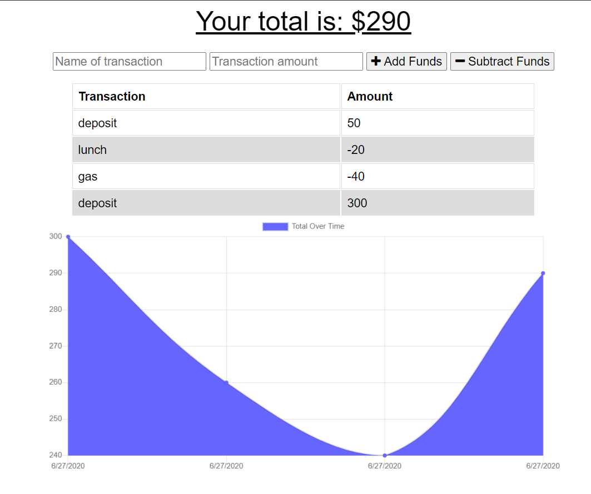

# Online/Offline Budget Tracker
The user will be able to add expenses and deposits to their budget with or without a connection. When entering transactions offline, they should populate the total when brought back online.

Offline Functionality:

  * Enter deposits offline

  * Enter expenses offline

When brought back online:

  * Offline entries should be added to tracker.

## Instructions:

   1. Enter a new transaction on "Name" & the amount on "Amount".
   2. Designate whether it is a debit or credit by selecting "Add Funds" or "Subtract Funds".
   3. Your amount will be logged on the graph, saved into the database.
   4. The new total is calculated and posted at the top of the screen.
   5. Enter the next transaction or save until later.

   